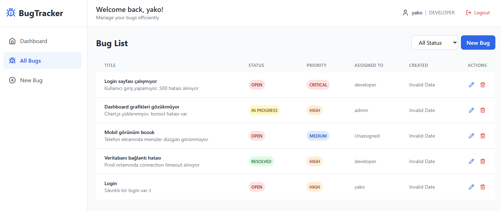
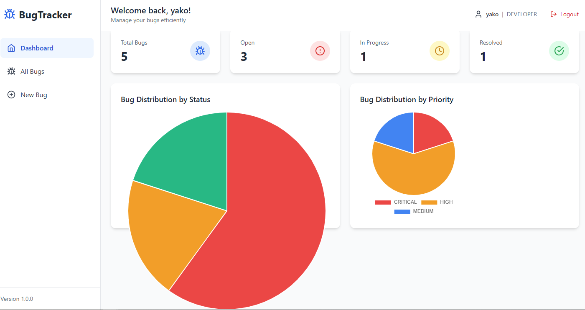

# Bug Tracker Application

A full-stack bug tracking system with Spring Boot backend and React frontend.





## Features
- Dashboard with bug statistics and charts
- Create, read, update, and delete bugs
- Filter bugs by status and priority
- Responsive design with sidebar navigation
- Mock authentication (any credentials work)
- Visual charts using Chart.js

## Technology Stack

| Backend | Frontend |
| :--- | :--- |
| Java 17 | React 18 |
| Spring Boot 3.2.0 | Tailwind CSS |
| Spring Data JPA | Chart.js |
| PostgreSQL 15 | React Hook Form |
| Maven | Axios |

## Quick Start with Docker

```bash
# Clone the repository
git clone <repository-url>
cd bug-tracker

# Build and run with Docker Compose
docker-compose up --build

# Access the application
# Frontend: http://localhost:3001
# Backend API: http://localhost:8081/api
```

# **Evolution of the Project** 

- [x] Phase 1 — Application → Spring Boot + React + PostgreSQL
- [x] [Phase 2](/docs/phases/02-docker.md) — Containerization → Docker + Docker Compose

- [ ] Phase 3 — Orchestration → Kubernetes
- [ ] Phase 4 — Packaging → Helm
- [ ] Phase 5 — Cloud Infrastructure → Floci
- [ ] Phase 6 — Infrastructure as Code → Terraform
- [ ] Phase 7 — CI GitHub → Actions
- [ ] Phase 8 — GitOps → ArgoCD
- [ ] Phase 9 — Observability Prometheus + Grafana + CloudWatch
- [ ] Phase 10 — Production Architecture → EKS + RDS + S3 + ALB + Route53 + ACM
